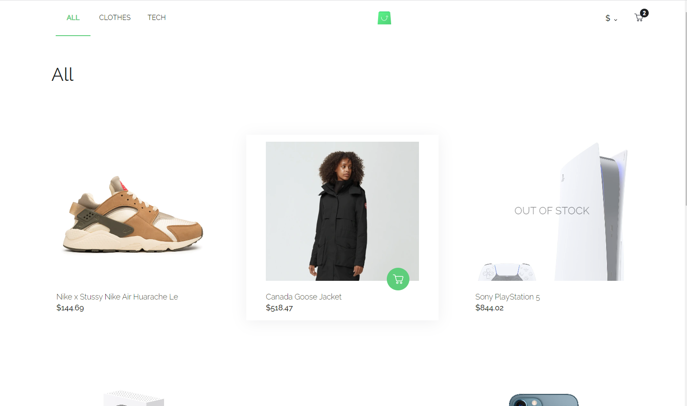
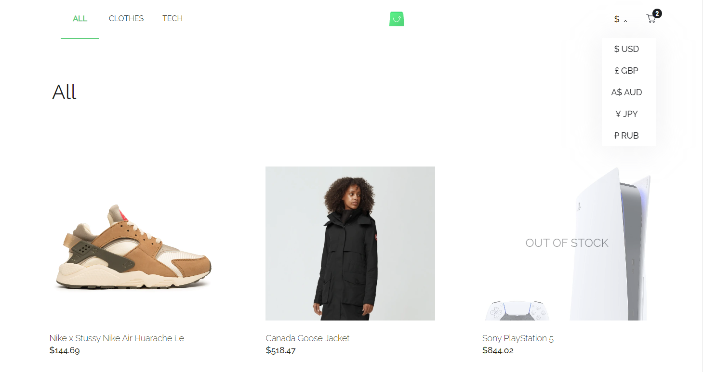
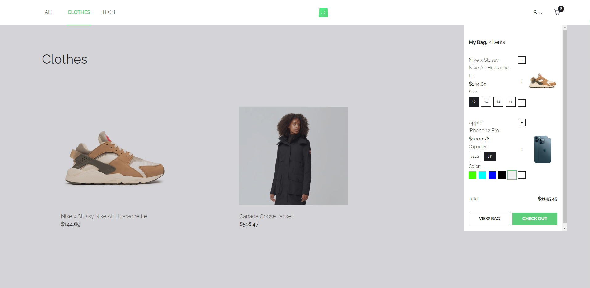
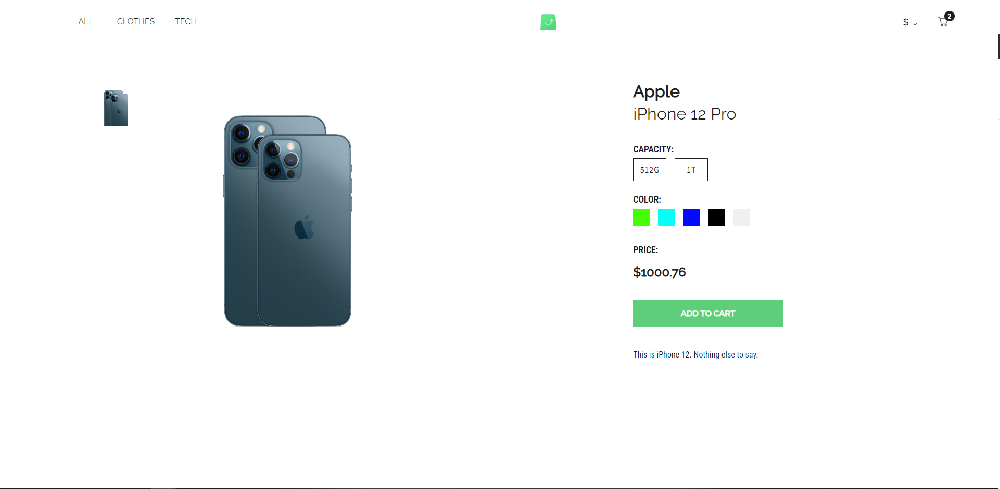
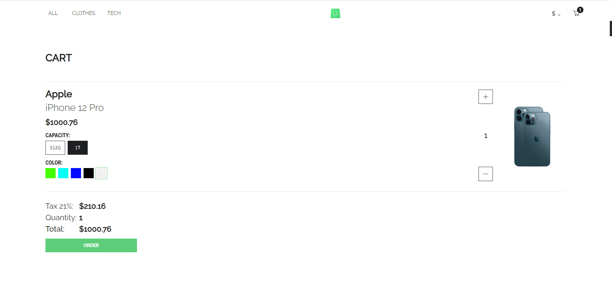

# Minimalistic-storefront

> A mock-up page of an imaginary online shop, fetching data from the GraphQL endpoint.  
> You can check live demo [_here_](https://minimalistic-storefront.web.app/).

## Table of Contents

- [General Info](#general-information)
- [Technologies Used](#technologies-used)
- [Features](#features)
- [Setup](#setup)
- [Acknowledgements](#acknowledgements)
- [Contact](#contact)

## General Information

- As the name suggests, it is an imaginary online shop, fetching data from the GraphQL endpoint.
- It consists of three main pages:
  - PLP (product listing page)
  - PDP (product description page)
  - Cart page
- More info on the project and screenshots can be found in [Features](#features).

## Technologies Used

- [React](https://react.dev/), [React Router](https://reactrouter.com/en/main), [TypeScript](https://www.typescriptlang.org/)
- [Apollo Client](https://www.apollographql.com/docs/react/) (GraphQL)
- [Redux](https://redux.js.org/) + [Redux Persist](https://github.com/rt2zz/redux-persist)
- Testing: [Jest](https://jestjs.io/), [React Testing Library](https://testing-library.com/docs/react-testing-library/intro/)
- Code Quality: [ESLint](https://eslint.org/), [Prettier](https://prettier.io/)
- CI/CD: [GitHub Actions](https://docs.github.com/en/actions), [Firebase Hosting](https://firebase.google.com/docs/hosting)
- Additional Tools: [React Transition Group](https://reactcommunity.org/react-transition-group/), [Interweave](https://interweave.dev/)

## Features

- Browse our store to choose from vast variety of products - whether you into tech or clothes you can be sure to find something that catches your eye.
  
- Easily switch between range of accepted currencies.
  
- Check what's in your cart at one click.
  
- Visit a product page to learn more about product and configure it to your needs.
  
- Proceed to the cart to see summary of your current buy.
  

## Setup

To run this project locally:

1. Clone this repository

```
  $git clone https://github.com/noszczykmichal/minimalistic-storefront
```

2. Go into the repository

```
  $cd minimalistic-storefront
```

3. Install dependencies

```
  $npm install
```

4. Run the app

```
  $npm start
```

## Acknowledgements

- Design and endpoint by [Scandiweb](https://github.com/scandiweb). The repo of the endpoint can be found [here](https://github.com/scandiweb/junior-react-endpoint).

## Contact

Built by [@noszczykmichal](https://michalnoszczyk.com/) - feel free to contact me!
