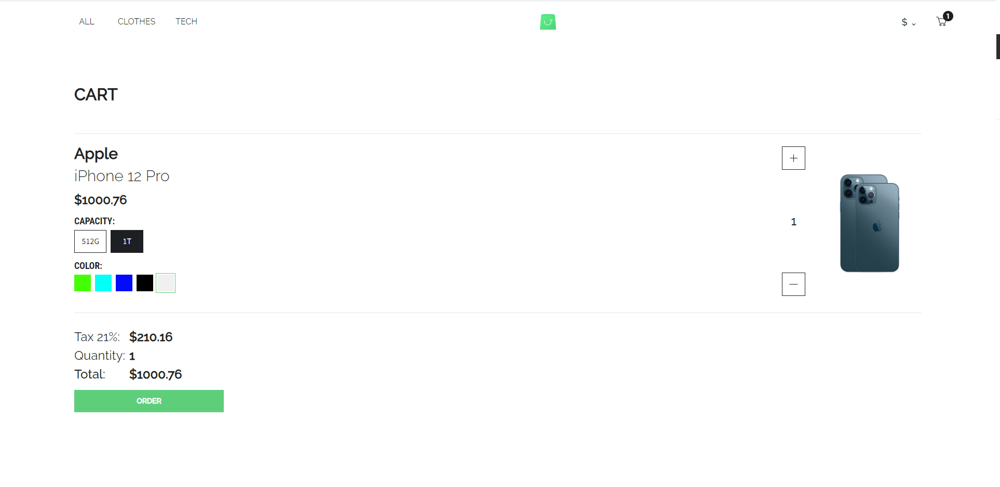

# Minimalistic-storefront

> A mock-up page of imaginary online shop fetching data from the GraphQL endpoint.

## Table of Contents

- [General Info](#general-information)
- [Technologies Used](#technologies-used)
- [Features](#features)
- [Setup](#setup)
- [Room for Improvement](#room-for-improvement)
- [Acknowledgements](#acknowledgements)
- [Contact](#contact)

## General Information

- As the name suggests, it is an imaginary online shop, fetching data from the GraphQL endpoint.
- It consists of three main pages:
  - PLP (product listing page)
  - PDP (product description page)
  - Cart page
- More info on the project and screenshots can be found in [Features](#features).

## Technologies Used

- [React 18](https://reactjs.org/blog/2022/03/29/react-v18.html)
- [React-DOM](https://www.npmjs.com/package/react-dom)
- [React-Router](https://github.com/remix-run/react-router)
- [PropTypes](https://www.npmjs.com/package/prop-types)
- [Apollo Client](https://www.apollographql.com/docs/react/)
- [React Transition Group](https://reactcommunity.org/react-transition-group/)
- [Redux](https://redux.js.org/)
- [Redux-Persist](https://github.com/rt2zz/redux-persist)
- [Interweave](https://interweave.dev/)
- [ESLint](https://www.npmjs.com/package/eslint)
- [Prettier](https://www.npmjs.com/package/prettier)

## Features

- Browse our store to choose from vast variety of products - whether you into tech or clothes you can be sure to find something that catches your eye.
  
- Easily switch between range of accepted currencies.
  
- Check what's in your cart at one click.
  
- Visit a product page to learn more about product and configure it to your needs.
  
- Proceed to the cart to see summary of your current buy.
  

## Setup

To run this project locally:

```
#Clone this repository
$git clone https://github.com/noszczykmichal/minimalistic-storefront
#Go into the repository
$cd minimalistic-storefront
#Install dependencies
$npm install
#Run the app
$npm start
```

## Room for Improvement

Room for improvement:

- RWD for all screen sizes (this was not part of original design).

## Acknowledgements

- Design and endpoint by [Scandiweb](https://github.com/scandiweb). The repo of the endpoint can be found [here](https://github.com/scandiweb/junior-react-endpoint).

## Contact

Created by [@noszczykmichal](https://www.linkedin.com/in/michal-noszczyk/) - feel free to contact me!
